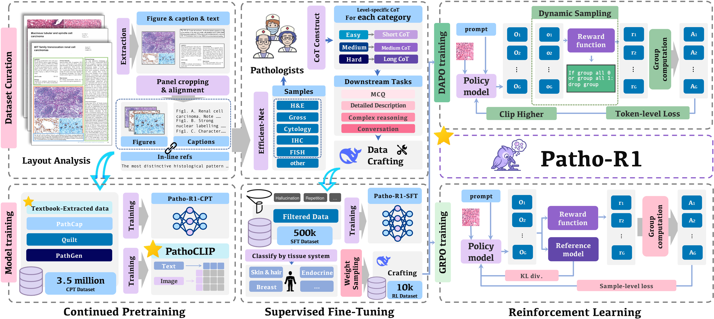

<div align="center" style="font-family: charter;">

<h1><i>Patho-R1</i>:</br>A Multimodal Reinforcement Learning-Based Pathology Expert Reasoner</h1>



<br />

<a href="https://arxiv.org/abs/2505.11404" target="_blank">
    
</a>
<a href="https://huggingface.co/WenchuanZhang/Patho-R1-3B">
  
</a>
<a href="https://huggingface.co/WenchuanZhang/Patho-R1-7B">
  
</a>
</div>

# Introduction📝
While vision-language models have shown impressive progress in general medical domains, pathology remains a challenging subfield due to its high-resolution image requirements and complex diagnostic reasoning.  

To address this gap, we introduce **Patho-R1**, a multimodal pathology reasoner designed to enhance diagnostic understanding through structured reasoning. **Patho-R1** is trained using a three-stage pipeline:  
1. *Continued pretraining* on **3.5M pathology figure-caption pairs** for domain knowledge acquisition  
2. *Supervised fine-tuning* on **500k expert-annotated Chain-of-Thought samples** to encourage reasoning  
3. *Reinforcement learning* with **Group Relative Policy Optimization** and **Decoupled CLIP and Dynamic sAmpling Policy Optimization** to refine response quality  

Experimental results show that **Patho-R1** achieves strong performance across key pathology tasks, including **multiple choice questions** and **visual question answering**, highlighting its potential for real-world pathology AI applications.

## TODOS📌
- [x] `2025-05-29` ⭐️: Initial release of Patho-R1 models and inference pipeline
- [ ] 🎯: Release Patho-CLIP model weights and evaluation script
- [ ] 🎯: Release training code and detailed dataset construction pipeline

# Installation🛠️
```bash
# Create and activate a new conda environment
conda create -n patho-r1 python=3.10 -y  
conda activate patho-r1

# Clone the repository and install dependencies
git clone https://github.com/Wenchuan-Zhang/Patho-R1.git
cd Patho-R1
pip install -e .
```

# Training🚉
```bash
torchrun 
```

# Inference
## Patho-CLIP
### Zero_shot cross-modality retrieval task (Image/Text)

**1. Request access to the model weights from the Huggingface model page [here](https://huggingface.co/WenchuanZhang/Patho-CLIP-B).**

**2. Download the model weights**

**3. Loading the model**

```python
import torch
from PIL import Image
import open_clip

model, _, preprocess = open_clip.create_model_and_transforms('ViT-B-16',pretrained='/path/to/PathoCLIP-B.pt')
tokenizer = open_clip.get_tokenizer('ViT-B-16')
model.eval()
device = 'cuda' if torch.cuda.is_available() else 'cpu'
model = model.to(device)
```
You should replace the `/path/to/PathoCLIP-B.pt` with your own true path.It is recommended to use absolute path.

**4. Load and preprocess the input image and prompts**
```python
image_tensor = preprocess(Image.open("data/example.jpg")) .unsqueeze(0).to(device)

prompts = [
    'Photomicrograph showing connective tissue stroma with malignant chondrocytes and areas of highly cellular tissue composed of small round or spindle-shaped cells along with areas of calcification (H&E stain, x200).',
    'IHC staining showing HMB-45 positivity in peripheral epitheloid cells.',
    'Tumor cells infiltrating adjacent bone (H and E, x400).',
    'Lung adenocarcinoma, H&E stain.',
    'The metastatic colorectal adenocarcinoma shows positive immunohistochemical staining for CDX2.',
    'Breast core biopsy shows colorectal metastatic adenocarcinoma with diffuse positive nuclear staining for CDX2.',
    'The metastatic tumor to the lymph node exhibits positive staining for GATA3.',
    'The sigmoid colon shows transmural invasion by adenocarcinoma.',
    'An image of a fish.' 
]
text = tokenizer(prompts).to(device)
```
**5. Calculate similarity**
```python
with torch.inference_mode():
    # Encode and normalize the image
    image_embeddings = model.encode_image(image_tensor) 
    image_embeddings = image_embeddings / image_embeddings.norm(dim=-1, keepdim=True)

    # Encode and normalize the text prompts
    text_embeddings = model.encode_text(text)  
    text_embeddings = text_embeddings / text_embeddings.norm(dim=-1, keepdim=True)

    # Compute cosine similarity between image and each text prompt
    sim_scores = (image_embeddings @ text_embeddings.T).squeeze(0)  

ranked_scores, ranked_idx = torch.sort(sim_scores, descending=True)
print("Ranked list of prompts based on cosine similarity with the image:")
for idx, score in zip(ranked_idx, ranked_scores):
    print(f"\"{prompts[idx]}\": {score.item():.4f}")
```


# Acknowledgements✨
We gratefully acknowledge the contributions of the open-source community, particularly the following projects which laid the foundation for various components of this work:

- [Qwen](https://github.com/QwenLM) for providing powerful vision language models that significantly advanced our multimodal understanding and generation capabilities.  
- [DocLayout-YOLO](https://github.com/opendatalab/DocLayout-YOLO) for document layout detection.  
- [PaddleOCR](https://github.com/PaddlePaddle/PaddleOCR) for comprehensive optical character recognition.  
- [ModelScope Swift](https://github.com/modelscope/ms-swift) for efficient model serving and deployment tools.  
- [LLaMA-Factory](https://github.com/hiyouga/LLaMA-Factory) for robust LLM training and fine-tuning pipelines.  
- [VERL](https://github.com/volcengine/verl) for valuable visual-language pretraining resources.  
- [DeepSeek](https://github.com/deepseek-ai) for high-quality models and infrastructure supporting text understanding.

We thank the authors and contributors of these repositories for their dedication and impactful work, which made our development of Patho-R1 possible.

# Citation❤️
If you find our work helpful, a citation would be greatly appreciated. Also, consider giving us a star ⭐ on GitHub to support the project!

```
@article{zhang2025patho,
  title={Patho-R1: A Multimodal Reinforcement Learning-Based Pathology Expert Reasoner},
  author={Zhang, Wenchuan and Zhang, Penghao and Guo, Jingru and Cheng, Tao and Chen, Jie and Zhang, Shuwan and Zhang, Zhang and Yi, Yuhao and Bu, Hong},
  journal={arXiv preprint arXiv:2505.11404},
  year={2025}
}
```